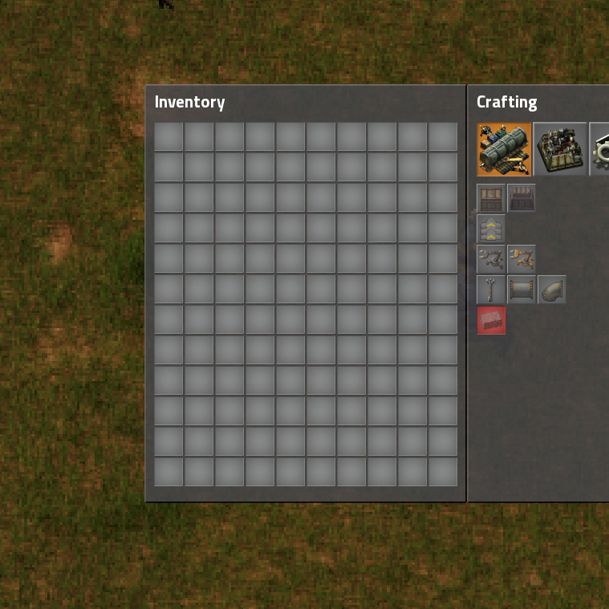

# CustomInventorySize
Factorio mod to allow for custom inventory sizes.

Defaults to 120 (2x), but allows you to configure it anywhere from 60 (factorio default) to 480 (8x).

Mod can be downloaded via any of these:
- In game through the mod menu (best option)
- The [factorio mod portal](https://mods.factorio.com/mods/Othyn/Custom%20Inventory%20Size)
- A build can be found in the repo's `/dist` directory.

Inspired by the original ["Larger Inventory"](https://github.com/Rseding91/Larger-Inventory) mod by [Rseding91](https://github.com/Rseding91).

## Changelog
1.0.1
- Updated for 0.16

1.0.0:
- Initial release